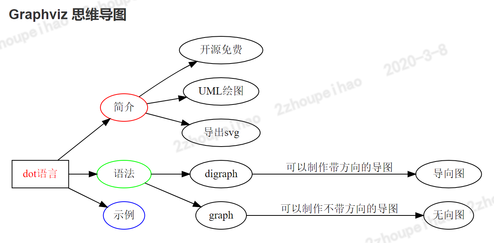

<p align="center">
    
</p>

# markdown-it-graphviz（基于 markdown-it 的 graphviz 扩展）


- [🔥 功能列表](#功能列表)
- [✨ 使用介绍](#使用介绍)
- [🚀 快速上手](#快速上手)
- [📚 开发文档](#开发文档)
- [📞 社区交流](#社区交流)

---

## markdown-it-graphviz 是什么鬼？

markdown-it-graphviz 是由哎呦迪奥编写的基于 graphviz 在 web 页面中生成各种图形的**Markdown-IT**扩展插件，种类繁多，我主要是用来生成思维导图，非常方便使用。

- ✂️ 轻量：在不依赖 graphviz 和修改后的 viz.js 的基础上，只有 2kb。mermaid 其实也差不多，不管它。
- ⚡ 易用：你怎么使用 markdown-it 的插件，就怎么使用它。
- ⚙️️ 简单: 虽然有两种使用方式，但非常简单，以使用 markdown-it 插件的方式来使用它。

| nodejs | npm   | size |
| ------ | ----- | ---- |
| > 8.0  | > 6.0 | 2kb  |

## 🔥 功能列表

markdown-it-graphviz 插件，将 graphviz 语法转换成各种图形，也算功能强大。
graphviz 有很多种图的（流程图、时序图、思维导图、行为图等等等），你可以去[graphviz官网](http://www.graphviz.org/documentation/)看哟。
也许官网上看到的不太直观，你可以去网上搜索，然后学习，也可以参考我从网上搜索到的几篇文章。

- [graphviz的基本语法及使用](https://blog.csdn.net/mouday/article/details/80902992?depth_1-utm_source=distribute.pc_relevant.none-task&utm_source=distribute.pc_relevant.none-task)
- [Graphviz 画图的一些总结](https://www.cnblogs.com/shuqin/p/11897207.html)

关于Graphviz语法代码高亮，可以在VS Code的扩展中安装插件，直接搜索 Graphviz，然后装装装，最后看看插件的使用教程。

---

## ✨ 使用介绍

### ⚔️ 安装指南

作为第三方依赖安装：

```bash
    npm install -S markdown-it-graphviz
```

### 📈 使用方法

---

局部使用（作为第三方依赖包来使用），在 node 环境下的 js 文件中复制以下代码进行粘贴：

```javascript
import markdownIt from 'markdown-it';
import markdownItGraphviz from 'markdown-it-graphviz';

// #region commonjs方式 Code Module

// const markdownItGraphviz = require('markdown-it-graphviz');

// #endregion commonjs方式 Code Module End

const mdi = markdownIt();
mdi.use(markdownItGraphviz);
mdi.render(`\`\`\`graphviz
digraph g {
	rankdir=LR  //方向左右
	dot语言->{简介,语法,示例}
	dot语言[shape=box,fontcolor=red]
	简介[color=red]
	语法[color=green]
	示例[color=blue]
	简介->{开源免费,UML绘图,导出svg}
	语法->{"digraph","graph"}
	"digraph"->导向图[label=可以制作带方向的导图]
	"graph"->无向图[label=可以制作不带方向的导图]
}
\`\`\``);
```

---

### 😎 效果



---

## 🚀 快速上手

**安装**->**使用**

markdown-it 系列的插件怎么使用的，markdown-it-graphviz 就怎么使用。

## 📚 开发文档

安装node后，使用命令 **npm start** ，打开浏览器，
输入地址 http://localhost:8989/index.html 或者 http://127.0.0.1:8989
就可以看到效果了，markdown源文件是 sample.md，页面中展示的效果根据这个markdown文件来进行展示的。


## 代码仓库

[github 链接](https://github.com/aiyoudiao/markdown-it-graphviz)

## 📞 社区交流

markdown-it-graphviz 也算是**哎呦系列**中一员，虽然它没有以aiyou开头，之后还会有其它的成员陆续上来。

加群交流：722703370


### 感谢以下开源项目

- viz.js
