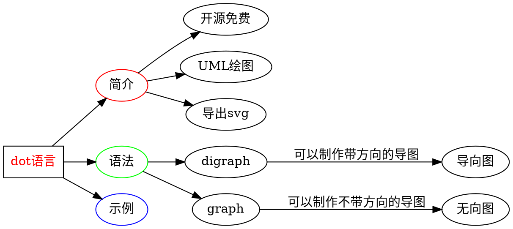
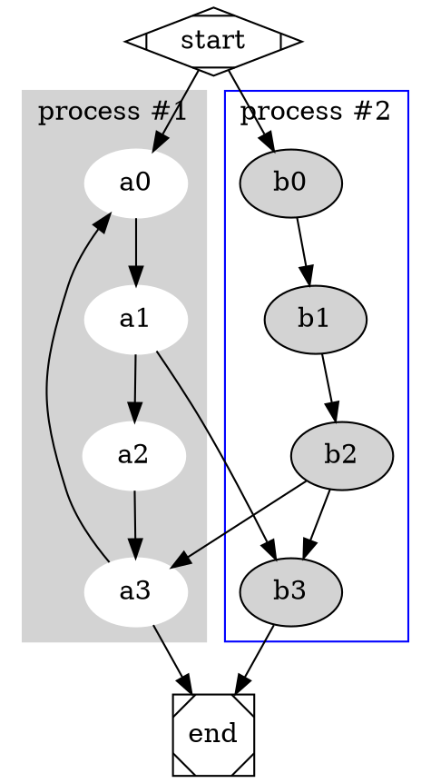
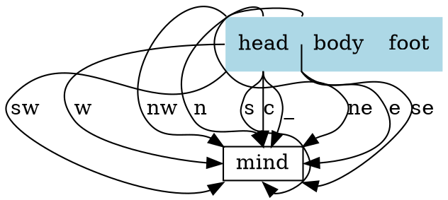
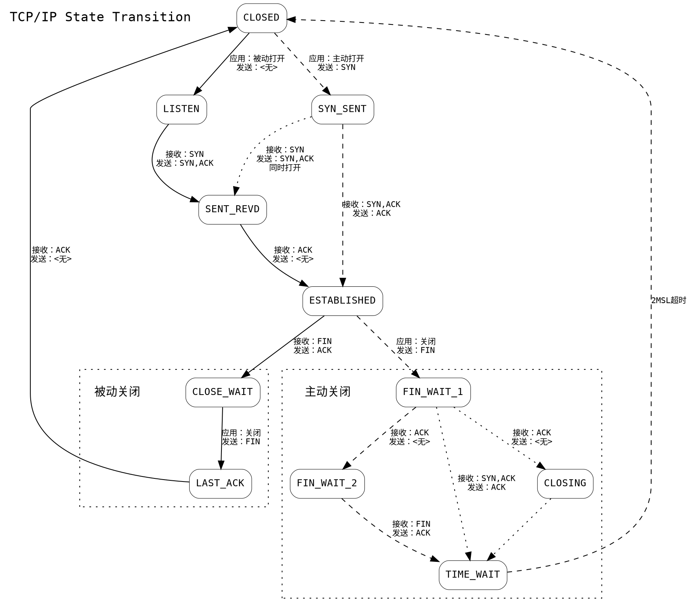
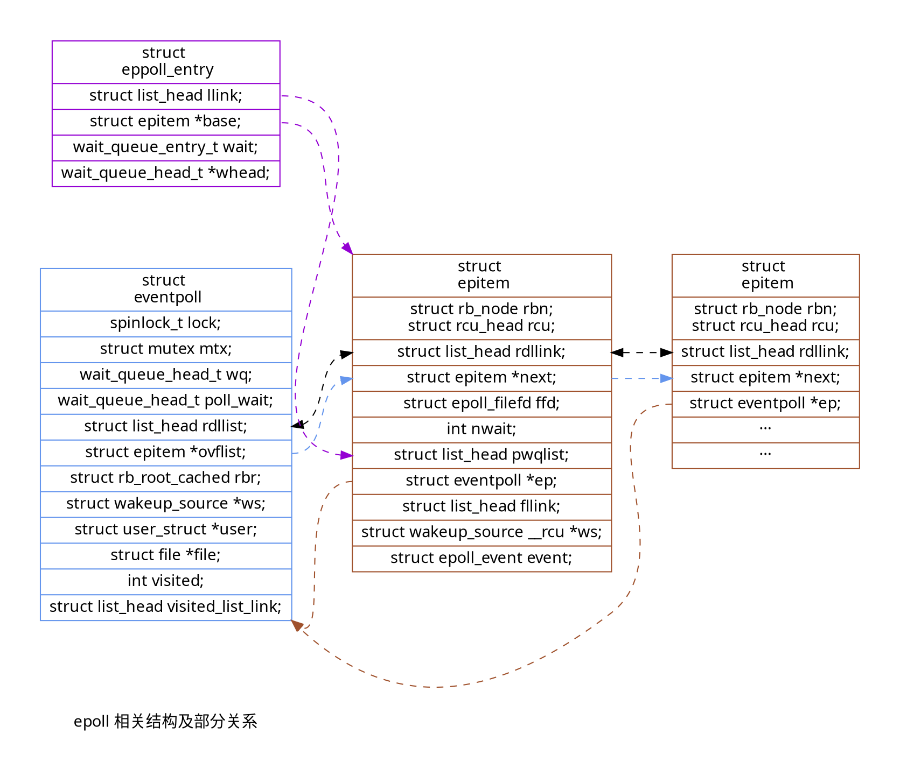

## Graphviz

### Graphviz 思维导图

```graphviz
digraph g {
	rankdir=LR  //方向左右
	dot语言->{简介,语法,示例}
	dot语言[shape=box,fontcolor=red]
	简介[color=red]
	语法[color=green]
	示例[color=blue]
	简介->{开源免费,UML绘图,导出svg}
	语法->{"digraph","graph"}
	"digraph"->导向图[label=可以制作带方向的导图]
	"graph"->无向图[label=可以制作不带方向的导图]
}
```

### Graphviz 流程图

```graphviz
digraph G {

	subgraph cluster_0 {
		style=filled;
		color=lightgrey;
		node [style=filled,color=white];
		a0 -> a1 -> a2 -> a3;
		label = "process #1";
	}

	subgraph cluster_1 {
		node [style=filled];
		b0 -> b1 -> b2 -> b3;
		label = "process #2";
		color=blue
	}
	start -> a0;
	start -> b0;
	a1 -> b3;
	b2 -> a3;
	a3 -> a0;
	a3 -> end;
	b3 -> end;

	start [shape=Mdiamond];
	end [shape=Msquare];
}
```

### Graphviz action 图

```graphviz
digraph action {
    node [shape = record,height=.1];

    node0 [label = "<head> head|<body> body|<foot> foot", height=.5]
    node2 [shape = box label="mind"]

    node0:head:n -> node2:n [label = "n"]
    node0:head:ne -> node2:ne [label = "ne"]
    node0:head:e -> node2:e [label = "e"]
    node0:head:se -> node2:se [label = "se"]
    node0:head:s -> node2:s [label = "s"]
    node0:head:sw -> node2:sw [label = "sw"]
    node0:head:w -> node2:w [label = "w"]
    node0:head:nw -> node2:nw [label = "nw"]
    node0:head:c -> node2:c [label = "c"]
    node0:head:_ -> node2:_ [label = "_"]

    node0:body[style=filled color=lightblue]
}
```

### Graphviz TCP IP 状态流程图

```graphviz
digraph {
    compound=true
    fontsize=10
    margin="0,0"
    ranksep = .75
    nodesep = .65

    node [shape=Mrecord fontname="Inconsolata, Consolas", fontsize=12, penwidth=0.5]
    edge [fontname="Inconsolata, Consolas", fontsize=10, arrowhead=normal]


    "TCP/IP State Transition" [shape = "plaintext", fontsize = 16]

    // now start server state transition
    "CLOSED" -> "LISTEN" [style = blod, label = "应用：被动打开\n发送：<无>"];
    "LISTEN" -> "SENT_REVD" [style = blod, label = "接收：SYN\n发送：SYN,ACK"]
    "SENT_REVD" -> "ESTABLISHED" [style = blod, label = "接收：ACK\n发送：<无>", weight = 20]
    "ESTABLISHED" -> "CLOSE_WAIT" [style = blod, label = "接收：FIN\n发送：ACK", weight = 20]

    subgraph cluster_passive_close {
        style = dotted
        margin = 10

        passive_close [shape = plaintext, label = "被动关闭", fontsize = 14]

        "CLOSE_WAIT" -> "LAST_ACK" [style = blod, label = "应用：关闭\n发送：FIN", weight = 10]
    }
    "LAST_ACK" -> "CLOSED" [style = blod, label = "接收：ACK\n发送：<无>"]

    // now start client state transition
    "CLOSED" -> "SYN_SENT" [style = dashed, label = "应用：主动打开\n发送：SYN"];
    "SYN_SENT" -> "ESTABLISHED" [style = dashed, label = "接收：SYN,ACK\n发送：ACK", weight = 25]
    "SYN_SENT" -> "SENT_REVD" [style = dotted, label = "接收：SYN\n发送：SYN,ACK\n同时打开"]
    "ESTABLISHED" -> "FIN_WAIT_1" [style = dashed, label = "应用：关闭\n发送：FIN", weight = 20]

    subgraph cluster_active_close {
        style = dotted
        margin = 10

        active_open [shape = plaintext, label = "主动关闭", fontsize = 14]

        "FIN_WAIT_1" -> "FIN_WAIT_2" [style = dashed, label = "接收：ACK\n发送：<无>"]
        "FIN_WAIT_2" -> "TIME_WAIT" [style = dashed, label = "接收：FIN\n发送：ACK"]
        "FIN_WAIT_1" -> "CLOSING" [style = dotted, label = "接收：ACK\n发送：<无>"]
        "FIN_WAIT_1" -> "TIME_WAIT" [style = dotted, label = "接收：SYN,ACK\n发送：ACK"]
        "CLOSING" -> "TIME_WAIT" [style = dotted]
    }

    "TIME_WAIT" -> "CLOSED" [style = dashed, label = "2MSL超时"]
}
```

### Graphviz epoll 相关数据结构及关系

```graphviz
digraph rankdot {
    compound=true
    margin="0,0"
    ranksep = .75
    nodesep = 1
    pad = .5
    rankdir = LR

    node [shape=record, charset = "UTF-8" fontname="Microsoft YaHei", fontsize=14]
    edge [style = dashed, charset = "UTF-8" fontname="Microsoft YaHei", fontsize=11]

    epoll [shape = plaintext, label = "epoll 相关结构及部分关系"]

    eventpoll [
        color = cornflowerblue,
        label = "<eventpoll> struct \n eventpoll |
            <lock> spinlock_t lock; |
            <mutex> struct mutex mtx; |
            <wq> wait_queue_head_t wq; |
            <poll_wait> wait_queue_head_t poll_wait; |
            <rdllist> struct list_head rdllist; |
            <ovflist> struct epitem *ovflist; |
            <rbr> struct rb_root_cached rbr; |
            <ws> struct wakeup_source *ws; |
            <user> struct user_struct *user; |
            <file> struct file *file; |
            <visited> int visited; |
            <visited_list_link> struct list_head visited_list_link;"
    ]

    epitem [
        color = sienna,
        label = "<epitem> struct \n epitem  |
            <rb>struct rb_node rbn;\nstruct rcu_head rcu; |
            <rdllink> struct list_head rdllink; |
            <next> struct epitem *next; |
            <ffd> struct epoll_filefd ffd; |
            <nwait> int nwait; |
            <pwqlist> struct list_head pwqlist; |
            <ep> struct eventpoll *ep; |
            <fllink> struct list_head fllink; |
            <ws> struct wakeup_source __rcu *ws; |
            <event> struct epoll_event event;"
    ]

    epitem2 [
        color = sienna,
        label = "<epitem> struct \n epitem |
            <rb>struct rb_node rbn;\nstruct rcu_head rcu; |
            <rdllink> struct list_head rdllink; |
            <next> struct epitem *next; |
            <ep> struct eventpoll *ep; |
             ··· |
             ··· "
    ]

    eppoll_entry [
        color = darkviolet,
        label = "<entry> struct \n eppoll_entry |
            <llink> struct list_head llink; |
            <base> struct epitem *base; |
            <wait> wait_queue_entry_t wait; |
            <whead> wait_queue_head_t *whead;"
    ]

    epitem:ep -> eventpoll:se [color = sienna]
    epitem2:ep -> eventpoll:se [color = sienna]
    eventpoll:ovflist -> epitem:next -> epitem2:next [color = cornflowerblue]
    eventpoll:rdllist -> epitem:rdllink -> epitem2:rdllink [dir = both]
    eppoll_entry:llink -> epitem:pwqlist [color = darkviolet]
    eppoll_entry:base -> epitem:nw  [color = darkviolet]
}
```
